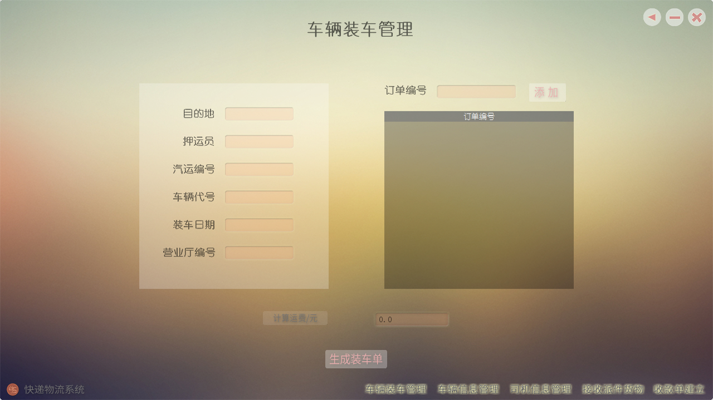
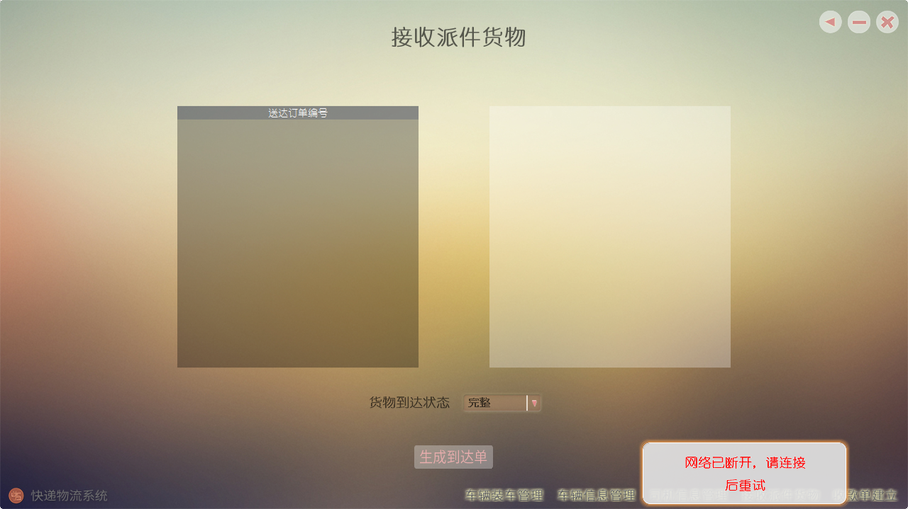
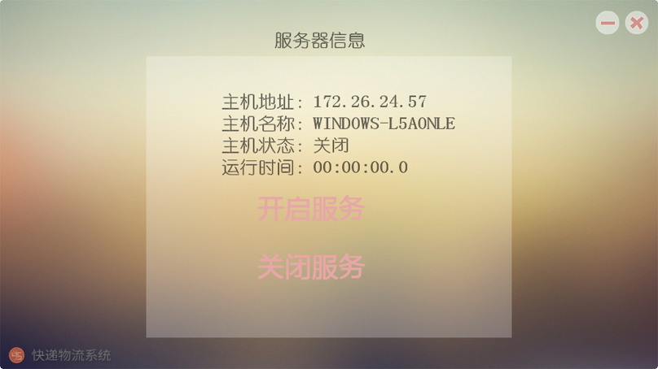

# SE2
Express Logistics System
##Project Introduction
The system is developed by four undergraduate from Nanjing University.  
It is a study program to learn the entire progress in Software Engineer, including requirement analysis, architecture design, integration testing, etc.

##Project Screenshot
####Exit Confirmation

####Vehicle Loading Management(Modular Design)

####Error Notification(Frosted Glass Design)

####Server

